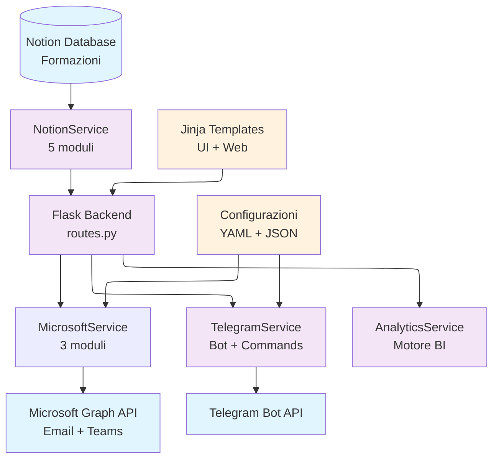

# 📚 Formazing - Documentazione

**Sistema di notifiche automatiche per formazioni aziendali tramite Telegram Bot**

## 📋 Indice Documentazione

### 🏗️ Architettura del Sistema
- [**🤖 Bot Telegram**](bot-telegram.md) - Sistema bot, comandi, formattazione messaggi
- [**📊 Analytics & Reporting**](analytics-service.md) - Business Intelligence, grafici e medie accademiche
- [**🔗 Servizio Notion**](notion-service.md) - Architettura modulare per integrazione Notion API
- [**🔷 Servizio Microsoft**](microsoft-service.md) - Integrazione Microsoft Graph API, Teams e calendario
- [**🧪 Testing & Quality**](testing/) - Sistema di test completo, fixture e validazione qualità
- [**📑 Templates**](templates/) - Guida all'UI dell'applicazione

### 📚 Guide Specializzate  
- **📊 Servizi Core** - Logica di business e orchestrazione *(da documentare)*
- **⚙️ Configurazione** - Setup ambiente, deployment, variabili *(da documentare)*
- **🔧 API Reference** - Endpoints Flask, parametri, esempi *(da documentare)*

---
## 🎯 Quick Start

### Panoramica del Sistema
Formazing è un sistema automatizzato che:
1. **Recupera** informazioni su formazioni aziendali da Notion
2. **Formatta** i dati secondo template configurabili 
3. **Invia** notifiche automatiche via Telegram ai gruppi appropriati
4. **Calendarizza** eventi e invia email tramite Microsoft Graph API
5. **Gestisce** comandi interattivi per consultazioni manuali
6. **Analizza** l'andamento storico e strategico tramite una dashboard di Analytics dedicata

---

## 🏗️ Architettura High-Level

```mermaid
---
config:
  layout: "elk"
---
graph TB
    %% Database e API esterne
    NotionDB[(Notion Database<br/>Formazioni)]
    MSGraph[Microsoft Graph API<br/>Email + Teams]
    TelegramAPI[Telegram Bot API]
    
    %% Core Backend
    Flask[Flask Backend<br/>routes.py]
    NotionService[NotionService<br/>5 moduli]
    MicrosoftService[MicrosoftService<br/>3 moduli]
    TelegramService[TelegramService<br/>Bot + Commands]
    AnalyticsService[AnalyticsService<br/>Motore BI]
    
    %% Configurazioni
    Config[Configurazioni<br/>YAML + JSON]
    Templates[Jinja Templates<br/>UI + Web]
    
    %% Flusso principale
    NotionDB --> NotionService
    NotionService --> Flask
    Flask --> TelegramService
    Flask --> MicrosoftService
    Flask --> AnalyticsService
    TelegramService --> TelegramAPI
    MicrosoftService --> MSGraph
    
    %% Configurazioni e UI
    Config --> TelegramService
    Config --> MicrosoftService
    Templates --> Flask
    
    %% Styling
    classDef external fill:#e1f5fe
    classDef core fill:#f3e5f5
    classDef config fill:#fff3e0
    
    class NotionDB,MSGraph,TelegramAPI external
    class Flask,NotionService,TelegramService,AnalyticsService core
    class Config,Templates config
```

**Componenti Principali:**
- **🔵 Servizi Esterni**: Notion (database), Microsoft Graph (email/Teams), Telegram Bot API
- **🟣 Core Backend**: Flask (orchestratore), NotionService (5 moduli), MicrosoftService (3 moduli), TelegramService (bot + comandi), AnalyticsService (elaborazione dati)
- **🟠 Configurazione & UI**: File YAML/JSON (gruppi + template messaggi), Jinja Templates (web UI)

**Flusso Dati:**
1. **NotionService** recupera formazioni dal database Notion
2. **Flask** orchestra il workflow e gestisce la web UI con Jinja
3. **AnalyticsService** elabora i dati per generare statistiche e grafici strategici
4. **MicrosoftService** crea eventi Teams e invia email via Graph API
5. **TelegramService** formatta e invia notifiche usando configurazioni YAML/JSON

## 📊 Stack Tecnologico

### 🔧 Backend Core
- **🐍 Python 3.9+** - Linguaggio principale
- **🌐 Flask** - Web framework per dashboard e API
- **🎨 Jinja2** - Template engine per UI web
- **🔗 Notion SDK** - Integrazione database formazioni

### 🤖 Integrazione Bot & Notifiche  
- **📱 python-telegram-bot** - SDK Telegram Bot API
- **📧 Microsoft Graph API** - Email e calendari Outlook/Teams
- **📝 PyYAML** - Template messaggi e configurazioni gruppi

### 🧪 Quality & Testing
- **🎯 pytest** - Framework testing principale  
- **🔧 Fixture modulari** - 39 fixture specializzate per testing
- **⚡ Quick test scripts** - Automazione testing Windows/Linux

---